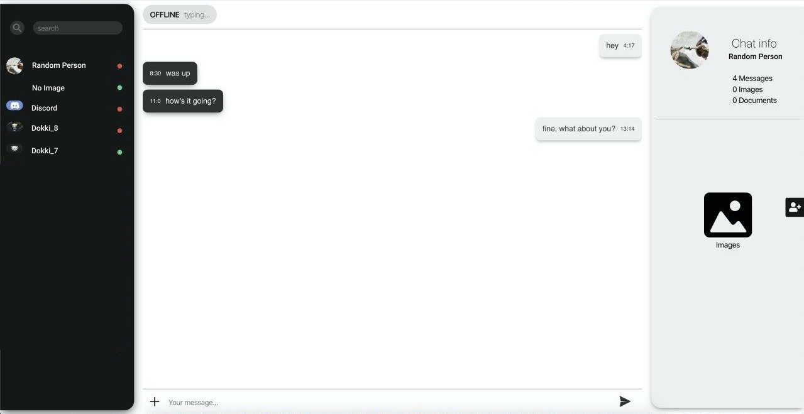

# web-messenger-2.0

A web based messenger build with reactjs+spring, first webchat was written with python and javascript, know I want to build something more complex with better functionality

### Functionality

 - search for people
 - send, accept and delete friend requests
 - send messages
 - search through friends list